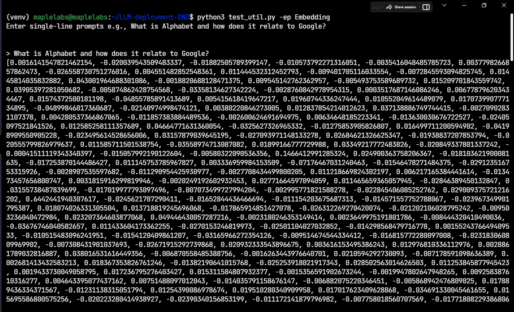
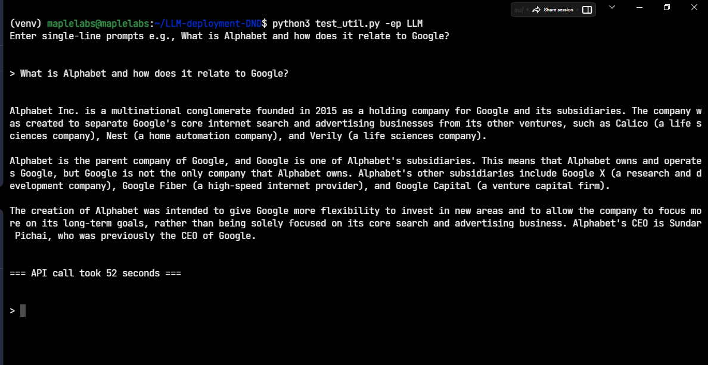
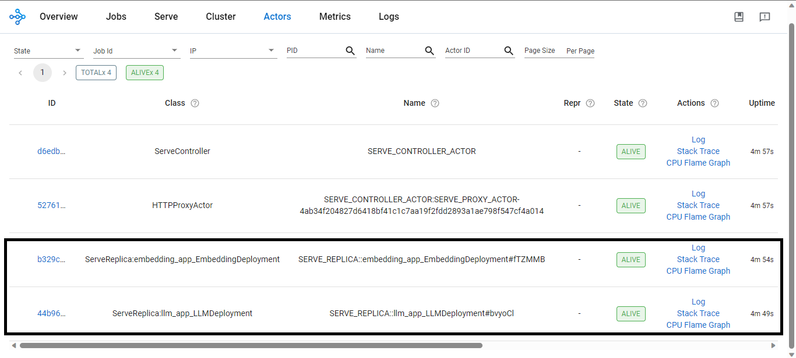
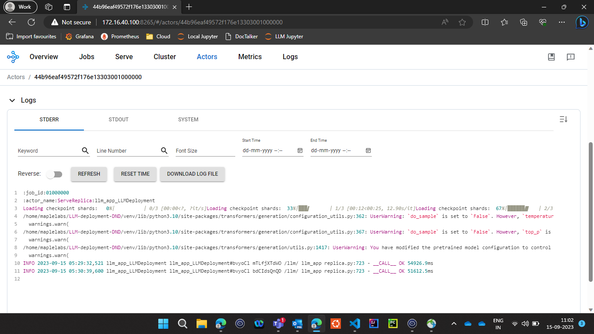

# Overview

This repository shows the deployment of an LLM and an Embedding model using single-node Ray cluster.
It is expected that you're using Ubuntu-22 which has python3


# Repository Details

- llm.py shows how to deploy Llama-2 with 13 billion parameters (full precision).  
  i.e., NousResearch/Llama-2-13b-chat-hf that is fine-tuned for conversational prompts

- embedding.py shows how to deploy an Embedding model.  
  Embedding models are used to generate numerical representations of strings which help in performing semantic search.  
  i.e., BAAI/bge-large-zh generates numerical arrays which captures the semantic meaning of input strings.  
  Vector databases like FAISS, Redis provide the ability perform similarity searches using these embeddings.

- os_requirements.txt shows the OS packages that were installed in Ubuntu 22

- py_requirements.txt shows the Python3 requirements


# Steps

- Run the apt install command present in os_requirements.txt file

- Create virtual-environment  
   ```bash
   python3 -m venv venv
   ```

- Activate virtal-environment  
   ```bash
   source venv/bin/activate
   ```

- Install pip packages  
   ```bash
   pip install --require-virtualenv -r py_requirements.txt
   ```

- Start the single-node Ray cluster. This also starts a UI based dashboard on `http://YOUR-VM-IP:8265` port.
  Dashboard can be used to explore logs, check resource utilization, and OOM errors etc.
  ```bash
  ray start --head --dashboard-host 0.0.0.0 --dashboard-port 8265 --num-cpus 8 --num-gpus 6
  ```

- Deploy the LLM and Embedding Apps/Actors on single-node Ray cluster
  ```bash
  serve deploy ray-config.yaml
  ```

- Other useful commands
  ```bash
  # Stop the Ray cluster
  ray stop

  # Check the status of Ray cluster
  ray status

  # Shutdown the current deployed Apps/Actors on Ray cluster
  serve shutdown

  # Get the status of Apps/Actors currently running on Ray cluster
  serve status

  # Show the utilization of all GPUs in your system. Hit Q to exit
  python3 -m nvitop
  ```


# Testing

- In order to try out the Embedding model
  ```
  python test_util.py -ep Embedding
  ```
  

- In order to try out the LLM model
  ```
  python test_util.py -ep LLM
  ```
  


# Debugging

If you face any issues with the LLM or the Embedding Model

- Check the Ray cluster status using `ray status`

- Check the application status using `serve status`

To check the logs of the appropriate Application/Actor in Ray dashboard.

- You'll need to open `http://YOUR-VM-IP:8265`

- Click on Actors
  

- click on LLM deployment (44b96 in the above image). Scroll down to see the output in StdOut, StdErr and System
  
